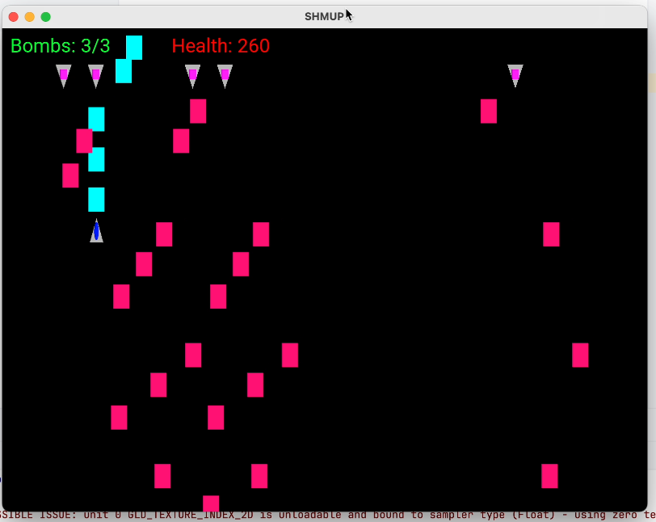

# SHMUP



CPSC 5270 Game project, refer to [docs](doc/engine_design) for game engine design.

> SHMUP is a shoot em up bullet hell game, where the player controls a space ship battling against aliens in outer space having to bob and weave through enemy projectiles to avoid getting hit. The focus of this game is to provide a challenging and appealing experience through game mechanics and visual graphics.

## Controls
```
WASD for movement
JKL for shooting
Hold LEFT_SHIFT while moving to slow down

Press ESC to close window
```

## Notes
- Developed using M1, this project is not portable on different machines.
- In CLion, Run > Edit Configurations > Working Directory == `$ProjectFileDir$/Src`
- Uses `safety` glazy code
