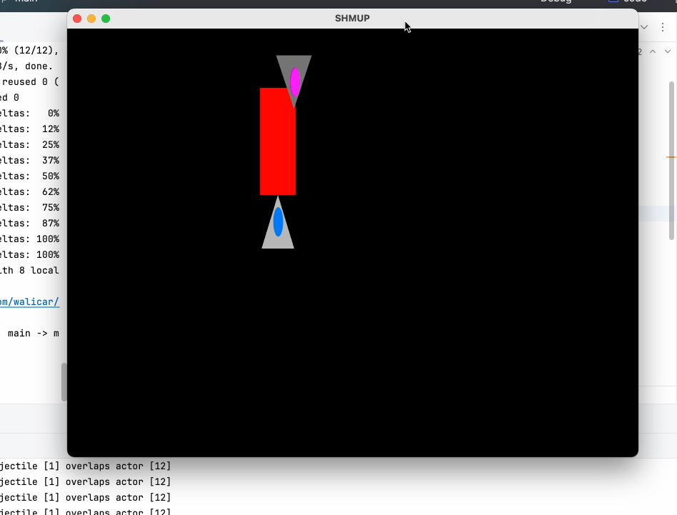
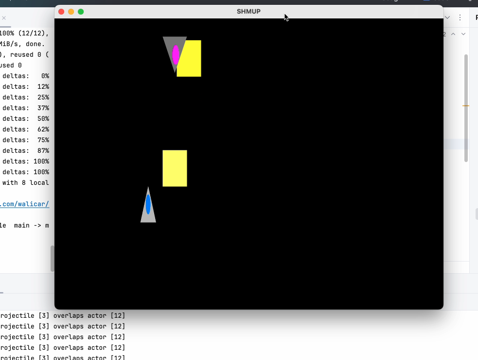

# Game Design
Ver 2.0

24-04-27

## Revisions
- Remove jet_bomb asset
  - having a color overlay would simplify development
  - the original idea was to have an animation of a bomb exploding
  - sprite animations were originally in stretch goals
- Remove Charge enemy
  - removing the charge enemy will make it easier for me to focus on enemies that only use projectiles
- Put "add sounds" as a stretch goal
  - gameplay is the priority of this project, sounds will be added only when the gameplay is finalized
- Cut down demo time from 5 minutes to 3 minutes
  - with the amount of the content that is planned, 3 minutes is more than enough to experience the game as whole
- Remove optimized memory usage from stretch goals, currently:
  - Engine preloads all textures and shaders to be used
  - Engine statically allocates the entities that will be used

## Summary
SHMUP is a shoot em up bullet hell game, where the player controls a spaceship battling against aliens in outer space having to bob and weave through enemy projectiles to avoid getting hit. The focus of this game is to provide a challenging and appealing experience through game mechanics and visual graphics.

The MVP will be a demo that deliver approximately 3 minutes of game time, as the player will only go through one scenario of the game. This level will end with a boss that tests the player's skill in dodging and learning patterns. The graphics in this demo will try to be as minimal as possible, prioritizing gameplay over appearance.

## Assets
A sprite image must be created for every entity that will exist, and every entity may share or have their own sprites for projectile

- Player
	- jet_sprite: Sprite
	- jet_sprite_hb: Sprite
		- exactly the same as jet_sprite but shows hurtbox
	- jet_bullet: Projectile
	- jet_beam: Projectile
	- ~~jet_bomb: Projectile~~
      - the screen will have a green overlay to represent the bomb exploding
- Grunt - 100hp, basic unit type that shoots bullets in the direction of the player
	- grunt_sprite: Sprite
	- enemy_bullet: Projectile
- Snipe - 100hp, small, but powerful, has a targeting laser that slowly tracks your position, and stops when it is about to shoot
	- snipe_sprite: Sprite
	- snipe_laser: Projectile
	- snipe_track: Sprite, 
      - the targeting laser
- ~~Charge - 50hp, weak, large, but can deal a lot of damage if you get hit by their hull, will charge at you~~
- Star - 200hp, large, shoots in a star pattern, requires the player to actually take care in dodging
	- star_sprite: Sprite
	- enemy_bullet: Projectile
- Hose - 200hp, hoses you down with bullets in a cone like fashion
	- hose_sprite: Sprite
	- enemy_bullet: Projectile
- Boss - 1000hp, combines snipe, star, and hose attacks
	- boss_sprite: Sprite
	- enemy_bullet: Projectile
	- boss_laser: Projectile
	- boss_track: Sprite 
      - the targeting laser

SHMUP will likely use FreeType to render text for the title and labels in its UI.

## Mechanics

### Player
The player will only have three lives, they will win the game if they defeat the final boss, or lose if they die prematurely. The player can use bombs to clear the screen of projectiles if they feel like they are in a pinch, enemies have a chance to drop bombs on defeat. The damage numbers on the beam and bullet attacks will need to be tested for balance, so they will be set by placeholder numbers for what I feel is best for now.

- "Focus dodging" - the player can hold SHIFT to display the players hurt box and slow down their movement to aid them in dodging projectiles  
- Bomb - the player can press "I" to deal screen wide damage and erase enemy projectiles
	- Can have atmost 3 bombs
	- 100 damage on hit
- Beam - the player can press "k" to shoot a laser beam that deals high damage, hitscan, but at the cost of a small hurt box 
	- 0.5 damage per frame?
	- Will need to figure out how to implement this
- Bullet - the player can press "j" to shoot projectiles that spread in cone like fashion, but at the cost of small damage
	- 10 damage on hit

### Enemies
When an enemy loses all of their HP they destroyed and cannot attack the player anymore, but the bullets/particles they created remain in play until they leave the screen. Enemies will spawn in by sliding from the top to their designated location, they will be considered active once they enter the screen and will shoot even though they are moving to their spot.

## Aesthetics
SpaceGame will address the Challenge and Discovery aesthetics because the player will need to learn the different enemy types, how to dodge their projectiles without getting hit and when it is viable to spend their bombs.

## Functionality

### Gameplay
- The player will move using WASD
- You can quit the game using Esc
- Resources are displayed on the lower right of the screen
	- Lives
	- Bombs

### Level Progression
A level will consist of several checkpoints, the requirement to progress is to destroy all the enemies spawned in that checkpoint. To implement this, the game engine will need to read from a file that tells them what enemies to spawn, where to spawn them, and what checkpoint they belong to.

## Stretch Goals
- ~~Optimized memory usage for projectiles~~
- Background has moving stars that make you feel like the player is moving
- Add sounds
- Sprite Animations
	- Different sprites when player is moving left or right
	- Unique animations when the final boss is attacking
	- Idle animations
	- Cool animation when the bomb explodes
- Enemies enter the screen in more interesting ways. In the MVP they will just slide in from the top, and remain in the upper half the screen.
- Enemies show an explosion sprite when they are defeated
- More enemy types
- Get points for destroying enemies, but lose points when the player gets hit by an enemy.

## Alpha Report

**Completed Features**
- General controls, except bomb button
- Focus movement
- Ability to shoot projectiles and lasers
- A collision detection system
- Basic sprites
- ECS

____

The player firing its laser at an enemy ship

The player hitting the enemy ship with a bullet while dodging an enemy bullet (light yellow)

