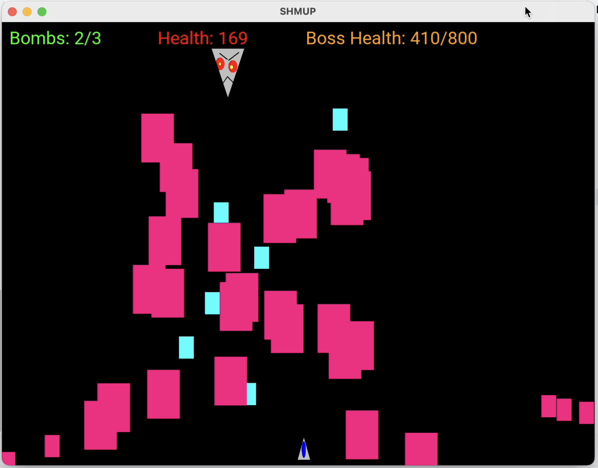
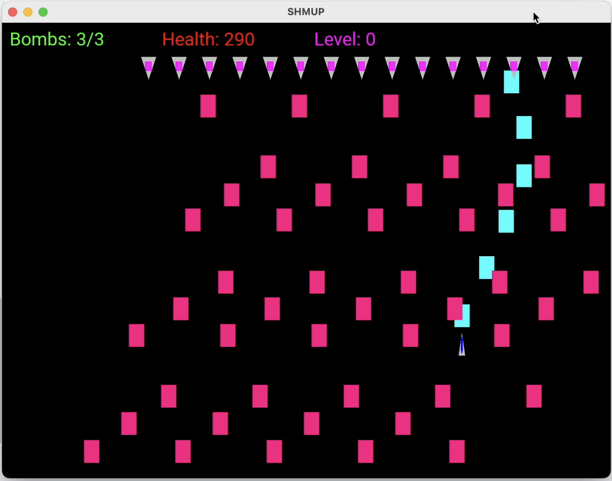
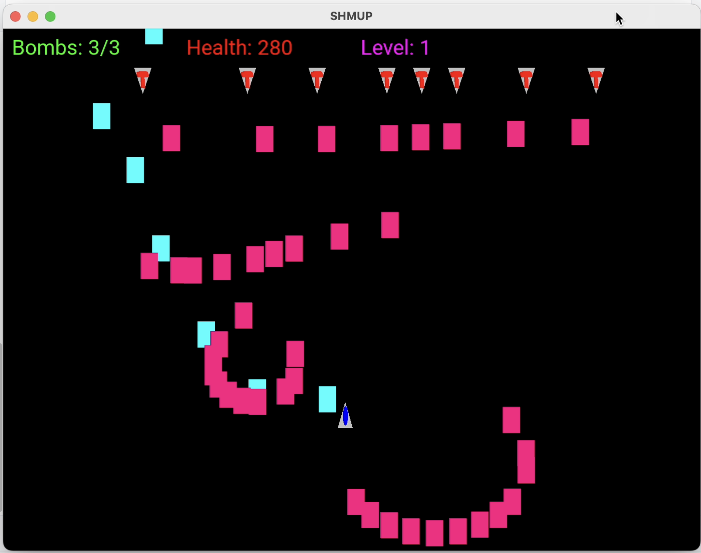

# Game Design

Ver 3.0

24-05-13

## Revisions
- Change bomb visual
  - It is now its own asset, and spawns like a bullet, and fades away
- There are no lives anymore and you can't regain bombs
  - to increase the challenge of the game
- Bomb will no longer deal damage to enemies, it will only clear projectiles
  - Since the demo is so short, you could just use 3 bombs and get to the final stage.
  - You cannot gain any bombs
- Star does not shoot in star pattern anymore, instead if shoots in an upside down V pattern for simplicity
  - No laser tracking anymore, for the same reason.
- Damage values adjusted
- Level progression changed
  - I will not implement file reading for checkpoint creation to ease development to meet 5/28 deadline
- Add a note in "Enemies" section about requiring the game engine to clean up projectiles

## Summary
SHMUP is a shoot em up bullet hell game, where the player controls a spaceship battling against aliens in outer space having to bob and weave through enemy projectiles to avoid getting hit. The focus of this game is to provide a challenging and appealing experience through game mechanics and visual graphics.

The MVP will be a demo that deliver approximately 3 minutes of game time, as the player will only go through one scenario of the game. This level will end with a boss that tests the player's skill in dodging and learning patterns. The graphics in this demo will try to be as minimal as possible, prioritizing gameplay over appearance.

## Assets
A sprite image must be created for every entity that will exist, and every entity may share or have their own sprites for projectile

- Player
	- jet_sprite: Sprite
	- jet_sprite_hb: Sprite
		- exactly the same as jet_sprite but shows hurtbox
	- jet_bullet: Projectile
	- jet_beam: Projectile
- Grunt - 100hp, basic unit type that shoots bullets in the direction of the player
	- grunt_sprite: Sprite
	- enemy_bullet: Projectile
- Snipe - 100hp, small, but powerful, has a targeting laser that slowly tracks your position, and stops when it is about to shoot
	- snipe_sprite: Sprite
	- snipe_laser: Projectile
- Star - 200HP, shoots in an upside V formation
- Hose - 200hp, hoses you down with bullets
	- hose_sprite: Sprite
	- enemy_bullet: Projectile
- Boss - 1000hp, combines snipe, and grunt attacks
	- boss_sprite: Sprite
	- enemy_bullet: Projectile

SHMUP will likely use FreeType to render text for the title and labels in its UI.

## Mechanics

### Player
The player will only have one life, they will win the game if they defeat the final boss, or lose if they die prematurely. The player can use bombs to clear the screen of projectiles if they feel like they are in a pinch. The damage numbers on the beam and bullet attacks will need to be tested for balance, so they will be set by placeholder numbers for what I feel is best for now.

- "Focus dodging" - the player can hold SHIFT to display the players hurt box and slow down their movement to aid them in dodging projectiles  
- Bomb - the player can press "I" to erase all enemy projectiles
	- Can only use 3 bombs
- Beam - the player can press "k" to shoot a laser beam that deals high damage, hitscan, but at the cost of a small hurt box 
	- 1 damage per timestamp
- Bullet - the player can press "j" to shoot projectiles that spread in cone like fashion, but at the cost of small damage
	- 15 damage on hit

### Enemies
When an enemy loses all of their HP they destroyed and cannot attack the player anymore, but the bullets/particles they created remain in play until they leave the screen. Enemies will spawn in by sliding from the top to their designated location, they will be considered active once they enter the screen and will shoot even though they are moving to their spot.

The game engine will need to know when stop rendering a projectile to preserve performance.

## Aesthetics
SpaceGame will address the Challenge and Discovery aesthetics because the player will need to learn the different enemy types, how to dodge their projectiles without getting hit and when it is viable to spend their bombs.

## Functionality

### Gameplay
- The player will move using WASD
- You can quit the game using Esc
- Resources are displayed on the top left of the screen
	- Bombs
    - Health

### Level Progression
A level will consist of 5 checkpoints, the requirement to progress is to destroy all the enemies spawned in that checkpoint. To implement this, the game engine will create what enemies to spawn for each checkpoint, and track game state.

## Stretch Goals
- Background has moving stars that make you feel like the player is moving
- Add sounds
- Sprite Animations
	- Idle animations

## Beta Report

**Completed Features**
- Level progression implemented through `spawn_system`
- Different enemy types: Snipe, Boss, Star, Hose
- Display health and bombs
- Player dies when hp <= 0
- Implement bomb attack
- Update textures

____

