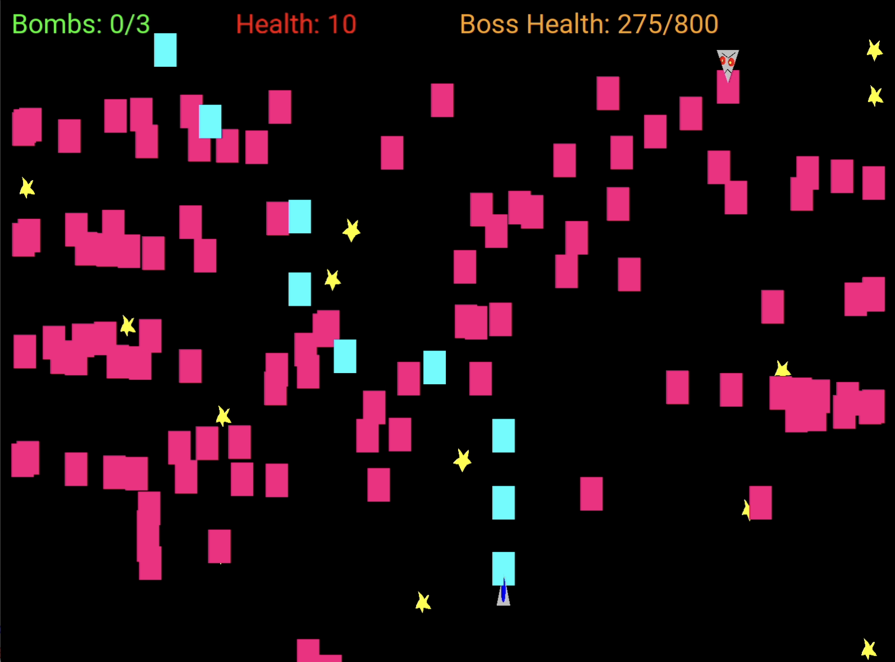

# Game Design

Ver 4.0

24-06-02

## Revisions

- Will not add a feature to show hitbox
	- The game engine was built in a way that does not easily support this
	- Cutting it out to meet deadline
	- Instead the player's jet will stop rotating to allow the player to get a better sense of their approximate hurtbox
- Health values for enemies have decreased to improve player experience

## Summary
SHMUP is a shoot em up bullet hell game, where the player controls a spaceship battling against aliens in outer space having to bob and weave through enemy projectiles to avoid getting hit. The focus of this game is to provide a challenging and appealing experience through game mechanics and visual graphics.

The MVP will be a demo that deliver approximately 3 minutes of game time, as the player will only go through one scenario of the game. This level will end with a boss that tests the player's skill in dodging and learning patterns. The graphics in this demo will try to be as minimal as possible, prioritizing gameplay over appearance.

## Assets
A sprite image must be created for every entity that will exist, and every entity may share or have their own sprites for projectile

- Player
	- jet_sprite: Sprite
	- jet_bullet: Projectile
	- jet_beam: Projectile
- Grunt - 100hp, basic unit type that shoots bullets in the direction of the player
	- grunt_sprite: Sprite
	- enemy_bullet: Projectile
- Snipe - 100hp, shoots bullets that track you
	- snipe_sprite: Sprite
	- enemy_bullet: Projectile
- Star - 50hp, shoots in an upside V formation
- Hose - 75hp, hoses you down with bullets
	- hose_sprite: Sprite
	- enemy_bullet: Projectile
- Boss - 800hp, combines snipe, and grunt attacks
	- boss_sprite: Sprite
	- enemy_bullet: Projectile

## Mechanics

### Player
The player will only have one life, they will win the game if they defeat the final boss, or lose if they die prematurely. The player can use bombs to clear the screen of projectiles if they feel like they are in a pinch.

- "Focus dodging" - the player can hold SHIFT to slow down their movement to help them dodge projectiles  
- Bomb - the player can press "l" to erase all enemy projectiles
	- Can only use 3 bombs
- Beam - the player can press "k" to shoot a laser beam that deals high hitscan damage, at the risk of getting close to the enemy
	- 2 damage per timestep
- Bullet - the player can press "j" to shoot projectiles that deal low damage
	- 15 damage on hit

### Enemies
When an enemy loses all of their HP they destroyed and cannot attack the player anymore, but the bullets/particles they created remain in play until they leave the screen. Enemies will spawn in from the top to their designated location, they will be considered active once they enter the screen and will shoot even though they are moving to their spot.

## Aesthetics
SpaceGame will address the Challenge and Discovery aesthetics because the player will need to learn the different enemy types, how to dodge their projectiles without getting hit and when it is viable to spend their bombs.

## Functionality

### Gameplay

- The player will move using WASD
- You can quit the game using Esc
- Resources are displayed on the top left of the screen
	- Bombs
    - Health

### Level Progression
A level will consist of 5 checkpoints, the requirement to progress is to destroy all the enemies spawned in that checkpoint. To implement this, the game engine will create what enemies to spawn for each checkpoint, and track game state.

## Final Report

**Completed Features**

- Added a title screen
- Reset game on player death or boss kill
- Add background animation to make the player feel like they're moving
- Components are deactivated once they're out of bounds to preserve performance
- Player cannot move off screen
- Refactor code to make it more understandable
	- Abstract game logic into separate class
	- Streamline entity creation by using sprite cache
- Ported game to web with emscripten
	- Game still works using CLion
- Many bug fixes

## Future Goals

- Add sounds
- Streamline engine
- Add more enemies

____

